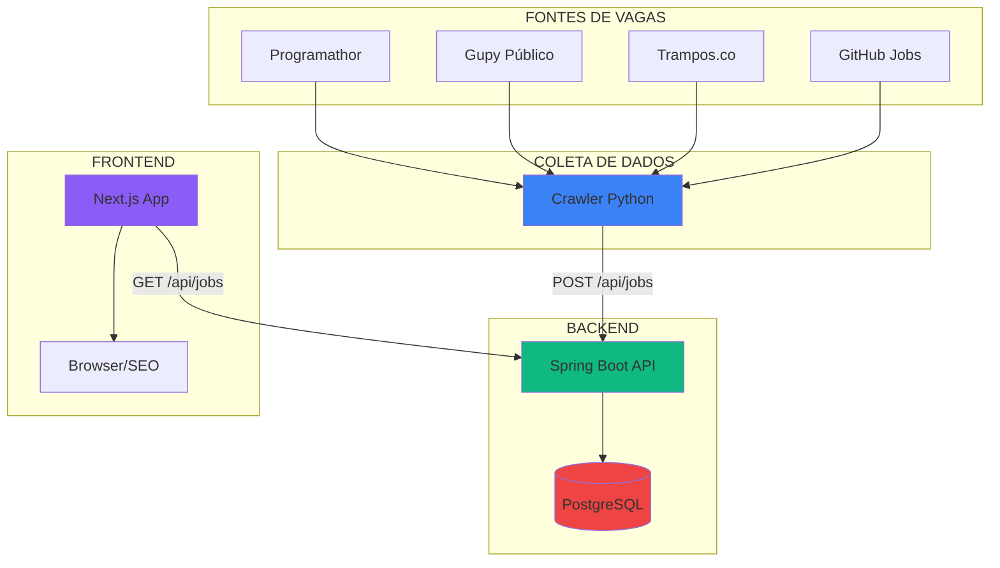
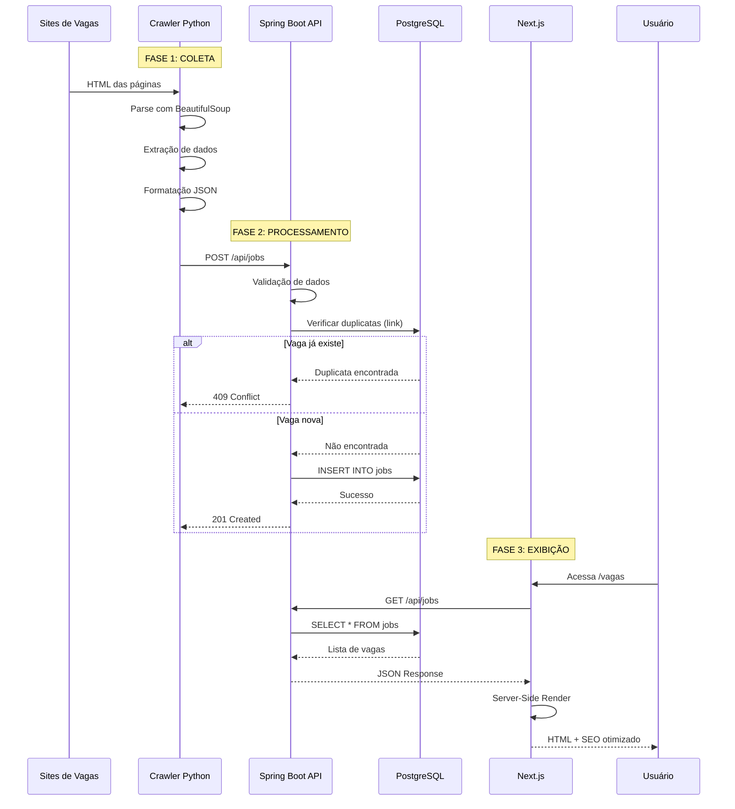
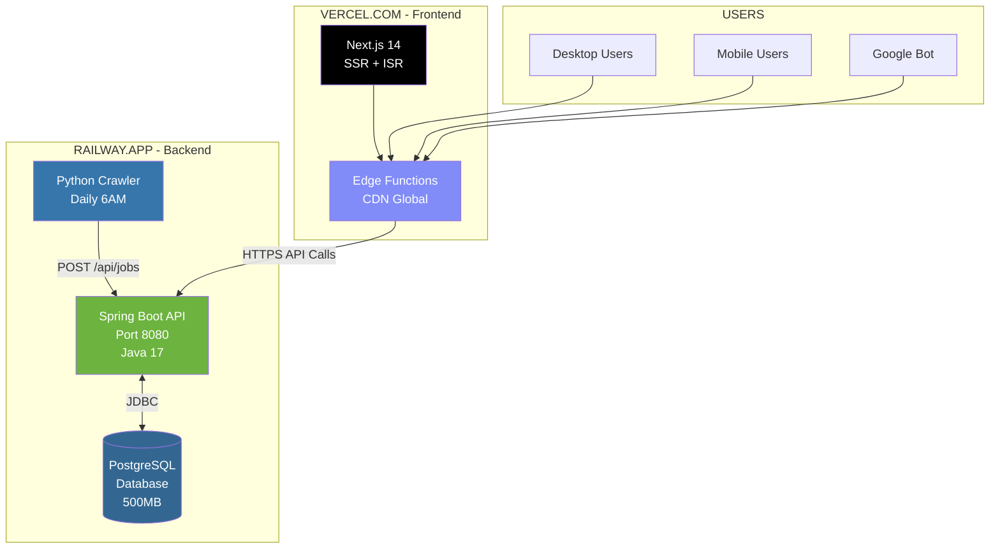
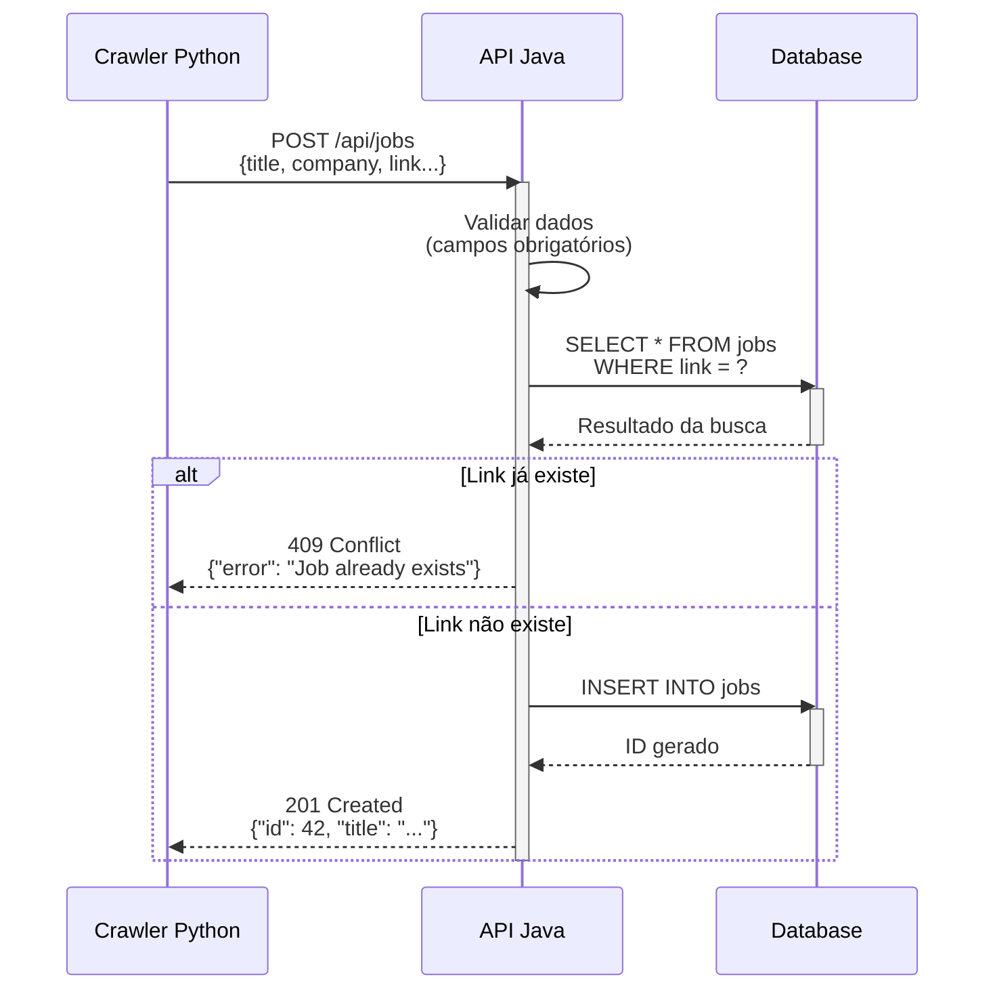
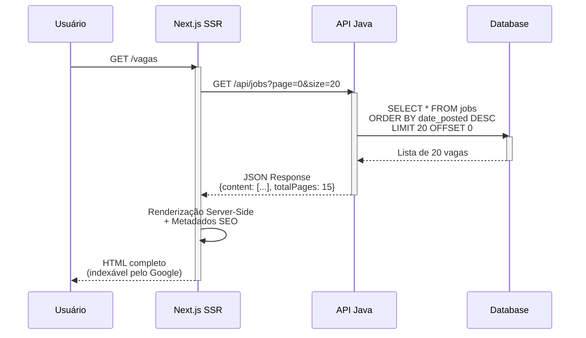
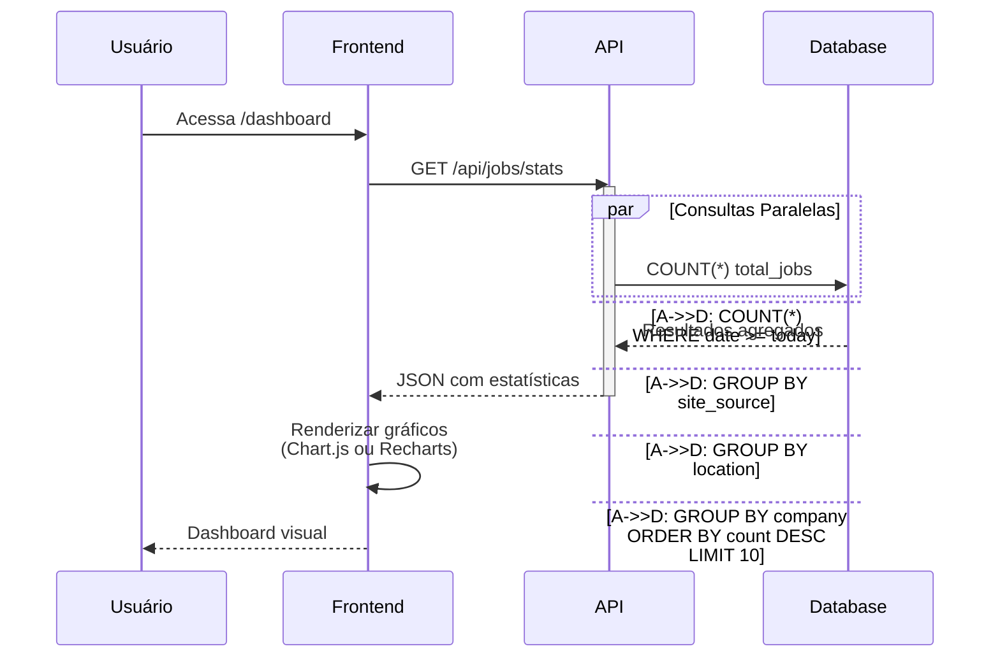
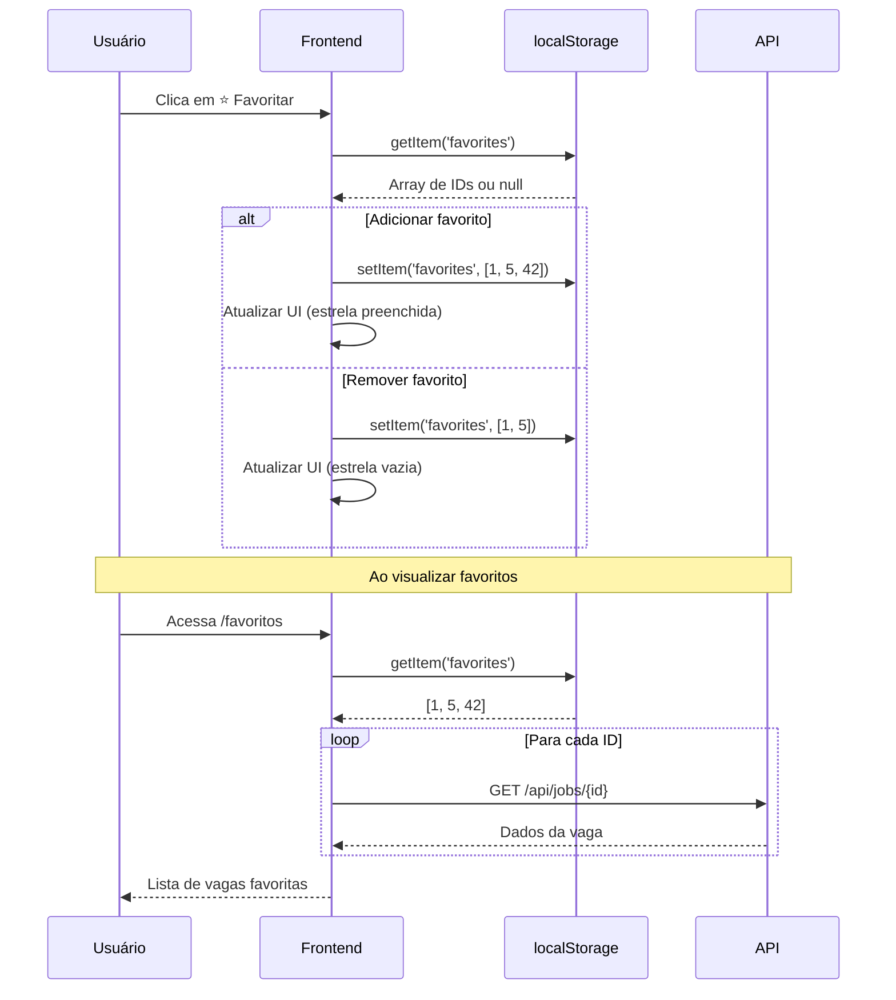

# 📋 Job Aggregator V1 - Documentação Completa

## 🎯 Visão Geral do Projeto

**Job Aggregator** é um agregador de vagas de tecnologia que coleta, centraliza e exibe oportunidades de emprego de múltiplas fontes da web. O projeto demonstra habilidades em arquitetura de microsserviços, integração de sistemas e desenvolvimento full-stack.

### Objetivos da V1 (MVP)
- ✅ Coletar vagas automaticamente de sites públicos
- ✅ Armazenar dados de forma estruturada evitando duplicações
- ✅ Exibir vagas em interface moderna e responsiva
- ✅ Garantir SEO otimizado para indexação
- ✅ Demonstrar arquitetura desacoplada e escalável
- ✅ **Dashboard com estatísticas básicas**
- ✅ **Sistema de favoritos (localStorage - sem auth)**
- ✅ **Autenticação JWT simples (opcional)**

---

## 🏗️ Arquitetura do Sistema

### Visão Macro



### Fluxo de Dados Detalhado



### Arquitetura de Deploy

```mermaid
graph LR
    subgraph "RAILWAY.APP"
        PG[(PostgreSQL<br/>500MB)]
        SPRING[Spring Boot API<br/>Java 17]
        CRON[Python Crawler<br/>Cron Job]
    end
    
    subgraph "VERCEL.COM"
        NEXT[Next.js 14<br/>SSR + SEO]
        CDN[CDN Global]
    end
    
    subgraph "USUÁRIOS"
        USER1[Desktop]
        USER2[Mobile]
        BOT[Google Bot]
    end
    
    CRON -->|POST| SPRING
    SPRING <-->|TCP| PG
    NEXT -->|HTTPS| SPRING
    NEXT --> CDN
    USER1 --> CDN
    USER2 --> CDN
    BOT --> CDN
    
    style PG fill:#336791
    style SPRING fill:#6db33f
    style CRON fill:#3776ab
    style NEXT fill:#000000
    style CDN fill:#818cf8
```



---

## 🗄️ Modelo de Dados

### Tabela: `jobs`

```sql
CREATE TABLE jobs (
    id              BIGSERIAL PRIMARY KEY,
    title           VARCHAR(255) NOT NULL,
    company         VARCHAR(255) NOT NULL,
    location        VARCHAR(255),
    link            VARCHAR(500) UNIQUE NOT NULL,
    site_source     VARCHAR(100) NOT NULL,
    date_posted     TIMESTAMP DEFAULT CURRENT_TIMESTAMP,
    created_at      TIMESTAMP DEFAULT CURRENT_TIMESTAMP,
    updated_at      TIMESTAMP DEFAULT CURRENT_TIMESTAMP
);

-- Índices para Performance
CREATE INDEX idx_jobs_title ON jobs(title);
CREATE INDEX idx_jobs_company ON jobs(company);
CREATE INDEX idx_jobs_date_posted ON jobs(date_posted DESC);
CREATE UNIQUE INDEX idx_jobs_link ON jobs(link);
```

### Tabela: `users` (Opcional - Auth JWT)

```sql
CREATE TABLE users (
    id              BIGSERIAL PRIMARY KEY,
    email           VARCHAR(255) UNIQUE NOT NULL,
    password        VARCHAR(255) NOT NULL,
    name            VARCHAR(255) NOT NULL,
    created_at      TIMESTAMP DEFAULT CURRENT_TIMESTAMP,
    updated_at      TIMESTAMP DEFAULT CURRENT_TIMESTAMP
);

CREATE UNIQUE INDEX idx_users_email ON users(email);
```

### Tabela: `favorites` (Opcional - Favoritos com Auth)

```sql
CREATE TABLE favorites (
    id              BIGSERIAL PRIMARY KEY,
    user_id         BIGINT NOT NULL,
    job_id          BIGINT NOT NULL,
    created_at      TIMESTAMP DEFAULT CURRENT_TIMESTAMP,
    FOREIGN KEY (user_id) REFERENCES users(id) ON DELETE CASCADE,
    FOREIGN KEY (job_id) REFERENCES jobs(id) ON DELETE CASCADE,
    UNIQUE(user_id, job_id)
);

CREATE INDEX idx_favorites_user ON favorites(user_id);
CREATE INDEX idx_favorites_job ON favorites(job_id);
```

### Estrutura de Dados (DTO)

```json
{
  "id": 1,
  "title": "Desenvolvedor Java Sênior",
  "company": "Nubank",
  "location": "Remoto",
  "link": "https://exemplo.com/vaga/123",
  "siteSource": "Programathor",
  "datePosted": "2024-12-06T10:30:00Z",
  "createdAt": "2024-12-06T10:35:00Z",
  "updatedAt": "2024-12-06T10:35:00Z"
}
```

---

## 🔌 API REST - Especificação Completa

### Base URL
```
http://localhost:8080/api
```

### Endpoints

#### 1. Criar Nova Vaga
```http
POST /api/jobs
Content-Type: application/json
```

**Request Body:**
```json
{
  "title": "Desenvolvedor Python Pleno",
  "company": "Magazine Luiza",
  "location": "São Paulo - SP",
  "link": "https://careers.magazineluiza.com.br/vaga/python-123",
  "siteSource": "Programathor"
}
```

**Response (201 Created):**
```json
{
  "id": 42,
  "title": "Desenvolvedor Python Pleno",
  "company": "Magazine Luiza",
  "location": "São Paulo - SP",
  "link": "https://careers.magazineluiza.com.br/vaga/python-123",
  "siteSource": "Programathor",
  "datePosted": "2024-12-06T14:22:00Z",
  "createdAt": "2024-12-06T14:22:00Z",
  "updatedAt": "2024-12-06T14:22:00Z"
}
```

**Response (409 Conflict - Duplicata):**
```json
{
  "error": "Job already exists",
  "message": "A vaga com este link já está cadastrada",
  "existingJobId": 15
}
```

---

#### 2. Listar Todas as Vagas
```http
GET /api/jobs
```

**Query Parameters (Opcionais):**
- `page` (int): Número da página (default: 0)
- `size` (int): Itens por página (default: 20, max: 100)
- `search` (string): Busca por título ou empresa
- `location` (string): Filtrar por localização
- `source` (string): Filtrar por fonte (ex: "Programathor")

**Exemplo:**
```http
GET /api/jobs?page=0&size=10&search=java&location=remoto
```

**Response (200 OK):**
```json
{
  "content": [
    {
      "id": 1,
      "title": "Desenvolvedor Java Sênior",
      "company": "Nubank",
      "location": "Remoto",
      "link": "https://nubank.com.br/careers/java-senior",
      "siteSource": "Programathor",
      "datePosted": "2024-12-05T09:00:00Z"
    }
  ],
  "pageable": {
    "pageNumber": 0,
    "pageSize": 10,
    "totalElements": 156,
    "totalPages": 16
  }
}
```

---

#### 3. Buscar Vaga por ID
```http
GET /api/jobs/{id}
```

**Response (200 OK):**
```json
{
  "id": 1,
  "title": "Desenvolvedor Java Sênior",
  "company": "Nubank",
  "location": "Remoto",
  "link": "https://nubank.com.br/careers/java-senior",
  "siteSource": "Programathor",
  "datePosted": "2024-12-05T09:00:00Z"
}
```

**Response (404 Not Found):**
```json
{
  "error": "Job not found",
  "message": "Vaga com ID 999 não encontrada"
}
```

---

#### 4. Estatísticas (Dashboard)
```http
GET /api/jobs/stats
```

**Response (200 OK):**
```json
{
  "totalJobs": 1247,
  "newJobsToday": 34,
  "newJobsThisWeek": 156,
  "jobsBySource": {
    "Programathor": 856,
    "LinkedIn": 243,
    "Gupy": 148
  },
  "jobsByLocation": {
    "Remoto": 623,
    "São Paulo": 312,
    "Belo Horizonte": 87,
    "Rio de Janeiro": 78
  },
  "topCompanies": [
    {"name": "Nubank", "count": 45},
    {"name": "iFood", "count": 38},
    {"name": "Magazine Luiza", "count": 32}
  ],
  "lastUpdate": "2024-12-06T14:30:00Z"
}
```

---

#### 5. Autenticação (Opcional para V1)

##### 5.1 Registro de Usuário
```http
POST /api/auth/register
Content-Type: application/json
```

**Request Body:**
```json
{
  "email": "usuario@email.com",
  "password": "senha123",
  "name": "João Silva"
}
```

**Response (201 Created):**
```json
{
  "id": 1,
  "email": "usuario@email.com",
  "name": "João Silva",
  "createdAt": "2024-12-06T15:00:00Z"
}
```

##### 5.2 Login
```http
POST /api/auth/login
Content-Type: application/json
```

**Request Body:**
```json
{
  "email": "usuario@email.com",
  "password": "senha123"
}
```

**Response (200 OK):**
```json
{
  "token": "eyJhbGciOiJIUzI1NiIsInR5cCI6IkpXVCJ9...",
  "type": "Bearer",
  "expiresIn": 86400,
  "user": {
    "id": 1,
    "email": "usuario@email.com",
    "name": "João Silva"
  }
}
```

##### 5.3 Favoritar Vaga
```http
POST /api/favorites/{jobId}
Authorization: Bearer {token}
```

**Response (200 OK):**
```json
{
  "message": "Vaga favoritada com sucesso",
  "jobId": 42
}
```

##### 5.4 Listar Favoritos
```http
GET /api/favorites
Authorization: Bearer {token}
```

**Response (200 OK):**
```json
{
  "favorites": [
    {
      "id": 1,
      "title": "Desenvolvedor Java Sênior",
      "company": "Nubank",
      "location": "Remoto",
      "favoritedAt": "2024-12-06T16:00:00Z"
    }
  ]
}
```

##### 5.5 Remover Favorito
```http
DELETE /api/favorites/{jobId}
Authorization: Bearer {token}
```

---

## 🛠️ Stack Tecnológica Detalhada

### 1. Backend - Core API (Java)

**Framework e Bibliotecas:**
```
├── Spring Boot 3.2+
│   ├── Spring Web (REST API)
│   ├── Spring Data JPA (Persistência)
│   ├── Spring Validation (Validação de Dados)
│   ├── Spring Security + JWT (Autenticação - Opcional)
│   └── Spring Boot Actuator (Monitoramento)
├── PostgreSQL Driver
├── Lombok (Redução de Boilerplate)
├── jjwt (Java JWT Library - se usar auth)
└── Maven ou Gradle (Build Tool)
```

**Estrutura de Pacotes:**
```
com.jobaggregator
├── controller/
│   ├── JobController.java
│   ├── AuthController.java (opcional)
│   └── FavoriteController.java (opcional)
├── service/
│   ├── JobService.java
│   ├── AuthService.java (opcional)
│   └── FavoriteService.java (opcional)
├── repository/
│   ├── JobRepository.java
│   ├── UserRepository.java (opcional)
│   └── FavoriteRepository.java (opcional)
├── entity/
│   ├── Job.java
│   ├── User.java (opcional)
│   └── Favorite.java (opcional)
├── dto/
│   ├── JobRequestDTO.java
│   ├── JobResponseDTO.java
│   ├── LoginRequestDTO.java (opcional)
│   └── AuthResponseDTO.java (opcional)
├── security/
│   ├── JwtTokenProvider.java (opcional)
│   └── SecurityConfig.java (opcional)
├── exception/
│   └── GlobalExceptionHandler.java
└── config/
    └── CorsConfig.java
```

**Configurações Essenciais (application.yml):**
```yaml
spring:
  datasource:
    url: jdbc:postgresql://localhost:5432/jobaggregator
    username: postgres
    password: postgres
  jpa:
    hibernate:
      ddl-auto: update
    show-sql: true
    
server:
  port: 8080
```

---

### 2. Crawler - Worker (Python)

**Bibliotecas:**
```
├── requests (HTTP Requests)
├── beautifulsoup4 (HTML Parsing)
├── lxml (Parser Rápido)
└── python-dotenv (Variáveis de Ambiente)
```

**Estrutura de Arquivos:**
```
crawler/
├── main.py
├── scrapers/
│   ├── programathor_scraper.py
│   ├── gupy_scraper.py
│   ├── trampos_scraper.py
│   └── github_scraper.py
├── utils/
│   └── api_client.py
├── requirements.txt
└── .env
```

**Sites Alvo para V1 (Testados e Seguros):**

#### ✅ **1. Programathor** (EXCELENTE para começar)
- **URL:** `https://programathor.com.br/jobs`
- **Dificuldade:** ⭐ Fácil
- **Rate Limit:** Tolerante
- **Dados:** Título, Empresa, Local, Link
- **Por quê:** HTML limpo, sem proteção anti-bot
- **Exemplo de classe:** `.job-card`, `.job-title`

#### ✅ **2. Gupy (Páginas Públicas)** (RECOMENDADO)
- **URL:** `https://portal.gupy.io/job-search/term=desenvolvedor`
- **Dificuldade:** ⭐⭐ Média
- **Rate Limit:** Moderado
- **Dados:** Completos (título, empresa, salário, remoto)
- **Por quê:** Muitas empresas usam, dados estruturados
- **Atenção:** Respeitar 2-3s entre requests

#### ✅ **3. Trampos.co** (ÓTIMO)
- **URL:** `https://trampos.co/oportunidades`
- **Dificuldade:** ⭐ Fácil
- **Rate Limit:** Muito tolerante
- **Dados:** Tech-focused, vagas de qualidade
- **Por quê:** Site brasileiro focado em tech
- **Filtro:** Adicionar `?q=desenvolvedor` na URL

#### ✅ **4. GitHub Jobs** (INTERNACIONAL)
- **URL:** `https://github.com/search?q=is:issue+is:open+label:"job"&type=issues`
- **Dificuldade:** ⭐ Fácil
- **Rate Limit:** GitHub é tolerante
- **Dados:** Issues com label "job"
- **Por quê:** Vagas reais de empresas tech

#### ✅ **5. Remote OK** (REMOTO)
- **URL:** `https://remoteok.com/remote-dev-jobs`
- **Dificuldade:** ⭐⭐ Média
- **Rate Limit:** Moderado
- **Dados:** Apenas vagas remotas internacionais
- **Por quê:** Especializado em remote work

#### ✅ **6. InfoJobs Brasil** (TRADICIONAL)
- **URL:** `https://www.infojobs.com.br/empregos.aspx?palabra=desenvolvedor`
- **Dificuldade:** ⭐⭐ Média
- **Rate Limit:** Tolerante
- **Dados:** Grande volume de vagas
- **Por quê:** Um dos maiores portais BR

---

#### ⚠️ **EVITE na V1:**

❌ **LinkedIn Jobs**
- Proteção anti-bot muito forte
- Requer autenticação
- IP ban frequente
- Captcha constante

❌ **Indeed Brasil**
- Sistema de rate limiting agressivo
- Estrutura HTML dinâmica (React)
- Requer renderização JS

❌ **Catho**
- Proteção contra scraping
- Dados protegidos por login

---

**Estratégia de Coleta Recomendada:**

```python
# Prioridade de implementação para V1
SCRAPERS = [
    "Programathor",      # Dia 1 - Mais fácil, testar pipeline
    "Trampos.co",        # Dia 2 - Similar, boas vagas
    "Gupy Público",      # Dia 3 - Mais complexo, alto volume
]

# Adicionar depois (V2)
SCRAPERS_V2 = [
    "GitHub Jobs",       # Internacional
    "Remote OK",         # Vagas remotas
    "InfoJobs",          # Volume alto
]
```

**Configurações de Rate Limiting:**
```python
RATE_LIMITS = {
    "Programathor": 1,   # 1 req/segundo
    "Trampos": 1,        # 1 req/segundo
    "Gupy": 3,           # 3 segundos entre requests
    "GitHub": 2,         # 2 req/segundo
}
```

**Boas Práticas:**
- ✅ Sempre adicionar User-Agent realista
- ✅ Respeitar robots.txt
- ✅ Implementar retry com backoff exponencial
- ✅ Logar erros mas não quebrar o pipeline
- ✅ Validar dados antes de enviar para API

**Estratégia de Execução:**
- Execução: Cronjob diário (ex: 06:00 AM)
- Timeout: 5 minutos por site (failsafe)
- Notificação: Log de erros via e-mail (V2)

---

### 3. Frontend - Client (Next.js)

**Framework e Bibliotecas:**
```
├── Next.js 14+ (App Router)
├── React 18+
├── TypeScript
├── Tailwind CSS (Estilização)
├── Axios ou Fetch API (HTTP Client)
└── React Icons (Ícones)
```

**Estrutura de Pastas:**
```
app/
├── page.tsx (Página Principal - Listagem)
├── dashboard/
│   └── page.tsx (Página de Estatísticas)
├── jobs/
│   └── [id]/page.tsx (Detalhes da Vaga)
├── auth/
│   ├── login/page.tsx (Login - Opcional)
│   └── register/page.tsx (Registro - Opcional)
├── favorites/
│   └── page.tsx (Vagas Favoritas - Opcional)
├── components/
│   ├── JobCard.tsx
│   ├── SearchBar.tsx
│   ├── Pagination.tsx
│   ├── StatsCard.tsx (Dashboard)
│   ├── FavoriteButton.tsx (Opcional)
│   └── Header.tsx (Com login/logout - Opcional)
├── lib/
│   ├── api.ts (Cliente API)
│   └── auth.ts (Gerenciamento JWT - Opcional)
├── hooks/
│   └── useFavorites.ts (Hook para favoritos)
└── layout.tsx
```

**Otimizações SEO:**
- ✅ Server-Side Rendering (SSR)
- ✅ Metadata dinâmica por página
- ✅ Sitemap.xml gerado automaticamente
- ✅ robots.txt configurado
- ✅ Open Graph tags

**Gerenciamento de Favoritos (2 Opções):**

**Opção 1 - localStorage (Sem Auth - Mais Simples):**
- Favoritos salvos no navegador do usuário
- Não precisa de backend adicional
- Perfeito para MVP e demonstração
- Implementação rápida

**Opção 2 - Backend com Auth (Com JWT):**
- Favoritos persistidos no banco
- Sincroniza entre dispositivos
- Requer login/registro
- Mais complexo mas mais profissional

---

### 4. Banco de Dados (PostgreSQL)

**Configuração:**
```
Version: PostgreSQL 15+
Port: 5432
Database: jobaggregator
```

**Estratégia de Backup:**
- Backup diário automatizado
- Retenção: 7 dias

---

## 🐳 Docker & Deploy

### Deploy Strategy



### Railway.app Configuration

**Serviços Necessários:**
1. **PostgreSQL Database** (Managed)
   - Plan: Hobby ($5/mês) ou Developer (Free com limites)
   - 500MB storage no free tier
   - Backup automático

2. **Spring Boot API** (Web Service)
   - Deploy via GitHub
   - Variáveis de ambiente
   - Sleep após 30min inatividade (free tier)

**Estimativa de Custos:**
- **Free Tier:** $0/mês (com limitações de sleep)
- **Hobby Plan:** $5/mês (sem sleep, melhor para portfolio)

### Vercel Configuration

**Vantagens:**
- ✅ Deploy automático via Git
- ✅ CDN global
- ✅ SSL gratuito
- ✅ Preview deployments
- ✅ 100% uptime (sem sleep)

### Docker Compose (Desenvolvimento Local)

```yaml
version: '3.8'

services:
  postgres:
    image: postgres:15
    container_name: jobaggregator-db
    environment:
      POSTGRES_DB: jobaggregator
      POSTGRES_USER: postgres
      POSTGRES_PASSWORD: postgres
    ports:
      - "5432:5432"
    volumes:
      - postgres_data:/var/lib/postgresql/data

  backend:
    build: ./backend
    container_name: jobaggregator-api
    ports:
      - "8080:8080"
    depends_on:
      - postgres
    environment:
      SPRING_DATASOURCE_URL: jdbc:postgresql://postgres:5432/jobaggregator
      SPRING_DATASOURCE_USERNAME: postgres
      SPRING_DATASOURCE_PASSWORD: postgres
      JWT_SECRET: your-secret-key-here-change-in-production

volumes:
  postgres_data:
```

**Comandos:**
```bash
# Desenvolvimento Local
docker-compose up -d

# Ver logs
docker-compose logs -f backend

# Parar tudo
docker-compose down
```

### Variáveis de Ambiente

**Backend (Railway):**
```env
# Database
SPRING_DATASOURCE_URL=jdbc:postgresql://host:5432/railway
SPRING_DATASOURCE_USERNAME=postgres
SPRING_DATASOURCE_PASSWORD=***

# CORS (permitir Vercel)
CORS_ALLOWED_ORIGINS=https://seu-app.vercel.app,http://localhost:3000

# JWT (se usar auth)
JWT_SECRET=seu-secret-super-seguro-aqui
JWT_EXPIRATION=86400000

# Server
SERVER_PORT=8080
```

**Frontend (Vercel):**
```env
# API URL
NEXT_PUBLIC_API_URL=https://seu-app.railway.app/api

# Opcional - Analytics
NEXT_PUBLIC_GA_ID=G-XXXXXXXXXX
```

### Configuração CORS (CRÍTICO!)

No Spring Boot, adicionar:
```java
@Configuration
public class CorsConfig {
    @Bean
    public WebMvcConfigurer corsConfigurer() {
        return new WebMvcConfigurer() {
            @Override
            public void addCorsMappings(CorsRegistry registry) {
                registry.addMapping("/api/**")
                    .allowedOrigins(
                        "https://seu-app.vercel.app",
                        "http://localhost:3000"
                    )
                    .allowedMethods("GET", "POST", "PUT", "DELETE")
                    .allowCredentials(true);
            }
        };
    }
}
```

---

## 📊 Diagramas de Sequência

### Fluxo de Criação de Vaga



### Fluxo de Listagem de Vagas



### Fluxo de Dashboard (Estatísticas)



### Fluxo de Favoritos (localStorage)



---

## 🎨 Interface do Usuário (Wireframe)

### Página Principal
```
┌─────────────────────────────────────────────────────────────┐
│  Job Aggregator            [Dashboard] [Login/User ▼]  🔍   │
├─────────────────────────────────────────────────────────────┤
│                                                              │
│  [📍 Localização ▼]  [💼 Fonte ▼]  [Buscar]                │
│                                                              │
│  ┌────────────────────────────────────────────────────┐    │
│  │ 💼 Desenvolvedor Java Sênior              ⭐️ [❤️]   │    │
│  │ 🏢 Nubank • 📍 Remoto • 📅 Há 2 dias                │    │
│  │ [Ver Detalhes]                        Programathor │    │
│  └────────────────────────────────────────────────────┘    │
│                                                              │
│  ┌────────────────────────────────────────────────────┐    │
│  │ 💼 Engenheiro Frontend React                  [❤️]   │    │
│  │ 🏢 iFood • 📍 São Paulo • 📅 Há 1 dia               │    │
│  │ [Ver Detalhes]                              Gupy   │    │
│  └────────────────────────────────────────────────────┘    │
│                                                              │
│  [← Anterior]  Página 1 de 15  [Próxima →]                 │
└─────────────────────────────────────────────────────────────┘
```

### Dashboard de Estatísticas
```
┌─────────────────────────────────────────────────────────────┐
│  📊 Dashboard de Estatísticas                          [×]   │
├─────────────────────────────────────────────────────────────┤
│                                                              │
│  ┌──────────┐  ┌──────────┐  ┌──────────┐  ┌──────────┐  │
│  │  1,247   │  │    34    │  │   156    │  │   623    │  │
│  │Total Vaga│  │   Hoje   │  │  Semana  │  │  Remotas │  │
│  └──────────┘  └──────────┘  └──────────┘  └──────────┘  │
│                                                              │
│  📈 Vagas por Fonte                                         │
│  ████████████████████ Programathor (856)                   │
│  ████████ LinkedIn (243)                                    │
│  █████ Gupy (148)                                           │
│                                                              │
│  📍 Top Localizações                                        │
│  ████████████████████████ Remoto (623)                     │
│  ██████████████ São Paulo (312)                            │
│  ███████ BH (87)                                            │
│                                                              │
│  🏢 Empresas que Mais Contratam                            │
│  1. Nubank - 45 vagas                                       │
│  2. iFood - 38 vagas                                        │
│  3. Magazine Luiza - 32 vagas                              │
│                                                              │
└─────────────────────────────────────────────────────────────┘
```

---

## 🚀 Roadmap de Desenvolvimento

### Semana 1: Backend Core + Dashboard
- [x] Configurar projeto Spring Boot
- [x] Criar modelo de dados (Entity Job)
- [x] Implementar JobRepository
- [x] Criar endpoints POST e GET
- [x] **Implementar endpoint /stats (Dashboard)**
- [x] Adicionar validação e tratamento de erros
- [x] Testar com Postman

### Semana 2: Crawler + Auth (Opcional)
- [x] Setup ambiente Python
- [x] Implementar scraper para Programathor
- [x] Criar cliente HTTP para API Java
- [x] Adicionar tratamento de erros
- [x] **(Opcional) Implementar JWT Authentication**
- [x] **(Opcional) Criar tabelas users/favorites**
- [x] Testar integração End-to-End

### Semana 3: Frontend + Dashboard + Favoritos
- [x] Setup Next.js com TypeScript
- [x] Criar componentes (JobCard, SearchBar)
- [x] **Implementar Dashboard com gráficos**
- [x] **Adicionar sistema de favoritos (localStorage OU com auth)**
- [x] Implementar listagem com paginação
- [x] Adicionar filtros de busca
- [x] Otimizar SEO (metadata, SSR)

### Semana 4: Deploy Railway + Vercel
- [x] Criar Docker Compose (local)
- [x] **Setup Railway (PostgreSQL + API Java)**
- [x] **Setup Vercel (Frontend Next.js)**
- [x] Configurar variáveis de ambiente
- [x] **Configurar CORS entre Railway e Vercel**
- [x] Documentação README
- [x] Testes finais em produção

---

## 📈 Métricas de Sucesso (V1)

**Técnicas:**
- ✅ API com tempo de resposta < 200ms
- ✅ Zero duplicatas no banco
- ✅ Crawler coleta mínimo 50 vagas/dia
- ✅ Frontend com Lighthouse Score > 90

**Portfólio:**
- ✅ Código limpo e organizado no GitHub
- ✅ README com diagramas e explicações
- ✅ Sistema funcionando em produção
- ✅ Demonstração clara de habilidades

---

## 🔮 Evolução Futura (Pós-V1)

**V2 - Features Intermediárias:**
- 📊 Analytics avançado (Google Analytics integration)
- 🔔 Sistema de alertas por e-mail (SendGrid/Mailgun)
- 🔍 Busca avançada com filtros múltiplos
- 📱 PWA (Progressive Web App)
- 🎨 Temas claro/escuro
- 📈 Gráficos interativos (Chart.js)

**V3 - Features Avançadas:**
- 🤖 IA para recomendação de vagas (Machine Learning)
- 💬 Sistema de reviews de empresas
- 📄 Parser de currículo (PDF upload)
- 🔗 Integração com LinkedIn API
- 📱 App Mobile (React Native)
- 🌐 Internacionalização (i18n)

---

## 💰 Análise de Custos (Railway + Vercel)

### Opção 1: Free Tier Total ($0/mês)
**Railway Developer Plan:**
- ✅ PostgreSQL 500MB
- ✅ API com sleep após inatividade
- ⚠️ Limitação: App "dorme" após 30min
- ⚠️ Pode levar ~30s para "acordar"

**Vercel Free:**
- ✅ Deploy ilimitado
- ✅ 100GB bandwidth
- ✅ Sem sleep

**Ideal para:** Demonstração de portfólio

---

### Opção 2: Hobby Plan ($5/mês) - RECOMENDADO
**Railway Hobby Plan:**
- ✅ Sem sleep (sempre ativo)
- ✅ Melhor performance
- ✅ Mais profissional para mostrar

**Vercel Free:**
- ✅ Mesmas vantagens

**Ideal para:** Portfólio profissional + possível uso real

---

### Comparação com Alternativas

| Plataforma | Custo | Vantagens | Desvantagens |
|------------|-------|-----------|--------------|
| **Railway** | $0-5/mês | Fácil deploy, PostgreSQL integrado | Sleep no free tier |
| **Render** | $0-7/mês | Similar ao Railway | Sleep também |
| **AWS/GCP** | $10-20/mês | Mais controle | Complexo para MVP |
| **Heroku** | $16/mês | Tradicional | Caro demais |

**Veredito:** Railway Hobby ($5/mês) + Vercel Free = Melhor custo-benefício!

---

## 💡 Diferenciais para o Portfólio

### Pontos a Destacar no README:

1. **Arquitetura Desacoplada:**
   > "A separação entre Crawler (Python) e API (Java) permite escalabilidade independente. O serviço de coleta pode rodar em múltiplas instâncias sem impactar a performance da API."

2. **Prevenção de Duplicatas:**
   > "Sistema inteligente de deduplicação usando índices únicos no banco e validação em camadas (database constraint + business logic)."

3. **SEO-First:**
   > "Implementação de SSR (Server-Side Rendering) garante que bots de busca indexem todo o conteúdo, aumentando a descoberta orgânica."

4. **Boas Práticas:**
   > "Código segue princípios SOLID, Clean Code e padrões REST. Testes unitários garantem qualidade e manutenibilidade."


---

**Versão:** 1.0.0  
**Última Atualização:** Dezembro 2024  
**Autor:** [Seu Nome]
